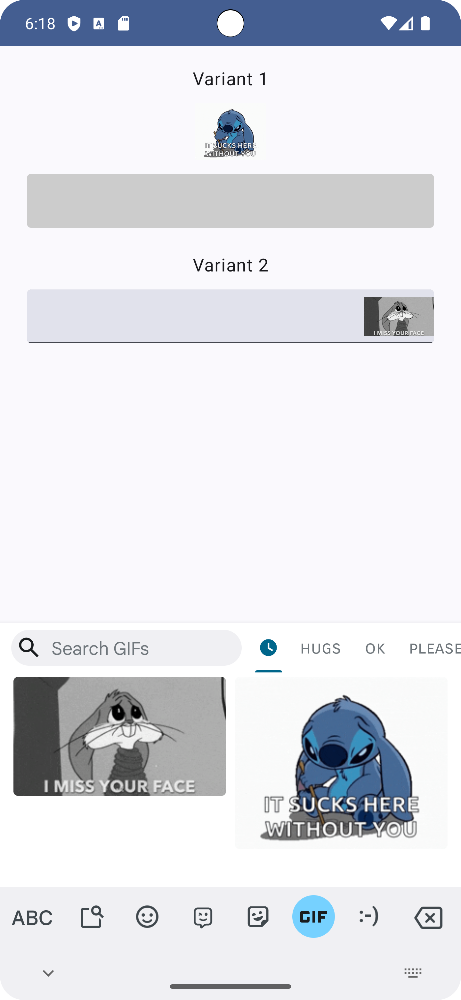

# Compose Receive Content

The application demonstrates the work of the new modifier in Jetpack Compose, named ReceiveContent added in the [androidx.compose.foundation:foundation-*:1.7.0-alpha01](https://developer.android.com/jetpack/androidx/releases/compose-foundation#1.7.0-alpha01) version and which has already been modified in the [alpha02](https://developer.android.com/jetpack/androidx/releases/compose-foundation#1.7.0-alpha02) version. The modifier allows user to take advantage of [Receive rich content](https://developer.android.com/develop/ui/views/receive-rich-content) and paste content directly to the text string from keyboard. At this stage this works exclusively with [BasicTextField2](https://developer.android.com/reference/kotlin/androidx/compose/foundation/text2/package-summary#BasicTextField2(androidx.compose.foundation.text2.input.TextFieldState,androidx.compose.ui.Modifier,kotlin.Boolean,kotlin.Boolean,androidx.compose.foundation.text2.input.InputTransformation,androidx.compose.ui.text.TextStyle,androidx.compose.foundation.text.KeyboardOptions,androidx.compose.foundation.text.KeyboardActions,androidx.compose.foundation.text2.input.TextFieldLineLimits,kotlin.Function2,androidx.compose.foundation.interaction.MutableInteractionSource,androidx.compose.ui.graphics.Brush,androidx.compose.foundation.text2.input.CodepointTransformation,androidx.compose.foundation.text2.input.OutputTransformation,androidx.compose.foundation.text2.input.TextFieldDecorator,androidx.compose.foundation.ScrollState)) and may have bugs on 3rd party keyboards

## About

### Functionality
- [Coil](https://github.com/coil-kt/coil)
- [Lazy Column](https://developer.android.com/jetpack/compose/lists)

### UI
- [Material 3](https://m3.material.io/develop/android)
